## Intro

I recently worked through a problem from a theory of computation textbook that asked me to prove a property of a language using finite automata.
The informal proof is a simple constructive proof where you build an automaton and show that it recognizes the language.
This is kind of similar to program verification, so I thought it'd be interesting to see what it takes to formalize the proof.
Lean is a good choice for this, because its [Mathlib](https://lean-lang.org/use-cases/mathlib/) has all the theorems for the problem.

After finishing the formal proof, I decided to write it up, because I think it provides software engineers with good insight into what it takes to formally prove properties of a system.

I tried to make this post accessible.
If you're comfortable with a modern statically typed programming language (such as TypeScript or Rust), binary arithmetic, and inductive proofs, you should be able to follow along.

## Background: DFAs & Regular Languages

*Feel free to skip this section if you're comfortable with DFAs and regular languages.*

Finite automata provide a theoretical model of computation with fixed memory.
Besides theory, finite automata also have important practical applications. 
For example, finite automata are relevant for parsers and regular expressions, where a [bug](https://blog.cloudflare.com/details-of-the-cloudflare-outage-on-july-2-2019/) once took a significant portion of the internet down.

### Deterministic Finite Automaton (DFA)

A **deterministic finite automaton** (DFA) is a machine with a fixed, finite set of states that reads its input one symbol at a time, left to right, updating its state with each symbol using a deterministic transition function.
After the last symbol, the machine either sits in an *accepting* state (input is accepted) or not (input is rejected).

If you've ever written a simple regular expression like `-?[0-9]+`, then you've constructed a DFA. 
This regex matches integer literals like `12` and `-123` and the corresponding DFA looks like this (the arrows are annotated with the symbols that lead to the next state):


This DFA has four states:
- **Start:** this is where we start before processing the first character. Since the start state is not an accepting state, we reject the empty string.
- **Sign:** we move to the sign state when we encounter the `-` character in the start state. We can skip the sign state and jump directly to digits from start, since the sign character is optional (`-?`). If we're in this state at the end of the string, then we reject the string.
- **Digits:** we move from start or sign to digits when we encounter a digit character (`[0-9]`). If we're in the digits state and encounter a digit character again, then we stay in the digit state. The digit state is the only accepting state of the DFA. If we're in this state after we've processed the input string, then the DFA accepts the string.
- **Dead:** we get into this state if we encounter any other character than a digit (unless it's a negative sign at the start). If we're in the dead state at the end of the string, then the DFA rejects the string. Once we're in the dead state, we stay in it, so the dead state in this DFA is a *sink*.

The set of input **symbols** to the machine is defined by the set $\Sigma$. 
In our regex example, $\Sigma = \left\{-, 0, 1, 2, \ldots, 9\right\}$.

### Regular Languages

A **language** is just a set of strings, also called **words**, and a language is called **regular** if some DFA accepts the strings in it. 
Recognizing regular languages is the class of decision problems solvable with a constant amount of memory in the input size.

Regular languages have useful closure properties: the union, intersection, complement, and (important for us) **reversal** of a regular language is regular.

The standard way to prove that a language is regular is to build a DFA and show that it accepts exactly that language.

We can describe a language $A$ with set-builder notation: 
$$A = \bigl\{\, w \in \Sigma^{*} \bigm| P(w) \,\bigr\}$$


$\Sigma^{*}$ means the set of strings that are created by all possible concatanations of symbols in $\Sigma$ and $P(w)$ is the logical proposition that the string $w$ is well-formed.

Let's apply this notation to our regex example: `-?[0-9]+`. Then $\Sigma^{*}$ contains string like `""`, `"123"`, `"-111"`, `"2-625-"`, etc. and $P(w)$ can be defined as "$w$ is not empty and only its first character can be a negative sign". 


## The Problem

The problem that we're going to solve is from the [Introduction to the Theory of Computation,](https://math.mit.edu/~sipser/book.html) 3rd ed. by Michael Sipser:

> **1.32** Let
>
> $$\Sigma_3 = \left\{ \begin{bmatrix}0\\0\\0\end{bmatrix}, \begin{bmatrix}0\\0\\1\end{bmatrix}, \begin{bmatrix}0\\1\\0\end{bmatrix}, \ldots, \begin{bmatrix}1\\1\\1\end{bmatrix} \right\}.$$
>
> $\Sigma_3$ is the set of all height-3 columns of 0s and 1s, so a string over
> $\Sigma_3$ determines three rows of bits. Reading each row as a binary number,
> define
>
> $$B = \bigl\{\, w \in \Sigma_3^{*} \bigm| P(w)  \,\bigr\}$$
>
> where $P(w)$ is the proposition that the the bottom row of $w$ equals the sum of the top two rows.
>
> Show that $B$ is regular. (Hint: it is easier to work with $B^{\mathcal{R}}$.)

The problem defines an unusual alphabet.
Instead of regular characters like `[a-z]`, the alphabet is made up of columns of three bits.
So instead of a language that consists of strings like `"apple"`, `"banana"`, etc, the language consists of two dimensional bit strings like

```
011
001
100
```

where the first column is the first "character" and so on.

The rule to decide whether a string is in the language is to add the first two rows of the string and check whether they match the third.

For example, the following string is in the language:

```
011 # x row: first term is 3 in decimal
001 # y row: second term is 1 in decimal
100 # z row: sum is 4 which is equal to 3 + 1
```

But the following string is not in the language:

```
01 # x row: first term is 1 in decimal
00 # y row: second term is 0
11 # z row: sum is 3 which is not equal to 1 + 0
```

While a language like this may look weird at first, it's actually a lot easier to write a program that recognizes this language as opposed to a program that recognizes a natural language, since we just need to check the equation

$$ x + y = z$$

to determine whether a string is in the language. 
The challenge is that we need to do this with a fixed amount of memory for arbitrarty long strings.

## The Solution

The trick is to remember how you add numbers by hand: you work from the least significant digit to the most significant, and the only thing you carry from one column to the next is the carry.

But a DFA reads left to right, and the problem presents the numbers most significant bit first.
So we don't recognize $B$ directly. 
Instead we build a DFA to recognize its reversal $B^R$ which is the same strings that are in $B$ written backwards, so the machine sees the least significant column first.

If we can build a DFA to recognize $B^R$, then we can conclude that $B^R$ is a regular language.
Since $B^R$ reversed is $B$, we can use of the closure property of the reversal of natural languages to conlcude that $B$ is regular as well which completes the solution.

### Adder Arithmetic

When doing the arithmetic column-by-column, we compute the sum bit at each step as follows: 

$$x_i \oplus y_i \oplus c_{in} = z_i$$ 

where $x, y$ are the addend bits, $z$ is the sum bit, $i$ denotes the ordinal of the current column, and $c_{in}$ is the input carry from the previous step.
We compute the output carry denoted $c_{out}$ for the next step as follows:

$$c_{out} = (x_i \wedge y_i) \vee \left( c_{in} \wedge (x_i \oplus y_i) \right)$$
This means that that there is a carry either if both terms are $\mathtt{1}$ or there was an input carry and least one of the terms is $\mathtt{1}$. Note that a simpler way to compute $c_{out}$ is to check if at least two of $x_i$, $y_i$ and $c_{in}$ are $\mathtt{1}$ (we'll make use of this in the Lean proof).

### Adder DFA

With this in mind, here is the DFA that recognizes $B^R$:


The adder DFA has three states:

- **Carry 0:** We're in this state if the carry is 0 before processing the next column. This is both the starting and the accepting state, since a leftover carry at the end would mean the sum overflowed the bottom row. 
- **Carry 1:** We're in this state if the carry is 1 before processing the next column. This state is non-accepting, since a word ending here has a carry left over, so the sum overflowed. But unlike the dead state we can still leave it, since a $\left[\begin{smallmatrix}\mathtt{0}\\\mathtt{0}\\\mathtt{1}\end{smallmatrix}\right]$ column absorbs the pending carry and takes us back to carry 0. 
- **Dead:** We end up in this state if the sum doesn't match. This is a sink state meaning it's terminal.


The arrows are annotated with the columns that lead from the input state to the output state.
If the figure looks confusing at first, the following examples will hopefully make it clearer.

### Example 1

Let's trace the first example from the problem through the DFA:

```
011 # x row: 3 in decimal
001 # y row: 1 in decimal
100 # z row: 4 in decimal
```

The DFA recognizes $B^R$, so it reads the columns backwards.
Unrolling the run turns it into a straight line with one copy of the state per step.


The run ends in carry 0 (the accepting state), so the reversed word is in $B^R$. 
Due to the closure property of reversal, the original word is in $B$ as well.

Note that the machine passes *through* the non-accepting carry 1 state twice.
Had the word stopped after either of the first two column, it would have been rejected, since $\mathtt{1} + \mathtt{1} = \mathtt{0}$ and $\mathtt{11} + \mathtt{01} = \mathtt{00}$ are both wrong without somewhere to put the carry.

### Example 2

Now the second example, which should be rejected:

```
01 # x row: 1 in decimal
00 # y row: 0 in decimal
11 # z row: 3 in decimal
```


The first column is fine on its own ($\mathtt{1} + \mathtt{0}$ really is $\mathtt{1}$) so the machine can't tell anything is wrong yet.
But the second column fails: with no carry pending, $\mathtt{0} + \mathtt{0}$ must produce $\mathtt{0}$, but the bottom row claims $\mathtt{1}$.
The run ends outside the accepting state, so the second example is rejected.

Note that since the dead state is a sink state, the string would get rejected even if there were more valid columns after the second column.


## The Lean Proof

Our goal is to show that the language $B$ from the [problem](#the-problem) is [regular.](#regular-languages)
As discussed earlier, in order to show that a language is regular, we need to build a [DFA](#deterministic-finite-automaton-dfa) and show that it accepts the language.

The Lean proof will consist of three parts:

1. A **specification** of the language $B$.
2. An executable **implementation** of the [adder DFA](#the-adder-DFA).
3. A **proof** showing that the implementation matches the specification.

Lean's [Mathlib](https://lean-lang.org/use-cases/mathlib/) has first class support for formal languages and DFAs, so we will just need to instantiate structures from the library for the specification and the implementation.

For the proof, we'll have to do more work, but Mathlib will be helpful here as well, as it contains the theorem that regular languages are closed under reversal, which will save a lot of work.
The proof will contain some unfamiliar syntax, but under the hood it's just a program.
In fact, the proof is accepted if the program compiles.

Below is a figure laying out the components of the program. The full code can be found on [Github.](https://github.com/agostbiro/my-lean/tree/main/theory-of-computation/TheoryOfComputation/Chapter1_Problem32)


### The Specification

The alphabet from the problem is made up of columns of three bits. 
We can represent one column with a tuple of three booleans in Lean:

```lean
abbrev Sigma3 := Bool × Bool × Bool
```

Then we use [`Mathlib.Computability.Language`](https://leanprover-community.github.io/mathlib4_docs/Mathlib/Computability/Language.html#Language) to define $B$:

```lean
def B : Language Sigma3 :=
  { wBE | row3BE wBE = row1BE wBE + row2BE wBE }
```

`Language` is a generic implementation of formal languages that comes with standard operations and associated theorems.
We instantiate it using our alphabet `Sigma3` and the predicate for membership in $B$ (recall that a language is a set of strings).

`wBE` is a big-endian word in the language, which is a list of `Sigma3` values, i.e. a 2D list of binary values with three rows.
`rowNBE` is a function that selects the nth row of the 2D list from the top and turns it into a natural number using a big-endian interpretation.[^1]
So the predicate is just 

$$z = x + y$$

from our earlier examples.

If you've used programming languages with set comprehensions, the set builder syntax might look familiar, but we're not constructing a collection here.
anguage` is just a `Set` under the hood and `Set` in Lean is a function that tests whether an element is in the set.[^2]
 our definition of $B$ gets unrolled to a function definition under the hood:

```lean
def B : List Sigma3 → Prop :=
  fun wBE => 
      row3BE wBE = row1BE wBE + row2BE wBE
```

The function has one argument of type `List Sigma3` which is a generic list that holds `Sigma3` objects. 
This is pretty standard so far, but the return type is more interesting.
In a typical programming language, you'd expect a membership test to return a boolean.
But the return value here is `Prop` which is the type of all propositions in Lean (a proposition is something that may or may not have a proof).

So how do membership tests work then?
The expression `wBE ∈ B` applies the function to `wBE`, which gives back a proposition.
In Lean a proposition is itself a type, and its values are proofs of the proposition.
So instead of evaluating `wBE ∈ B` to a boolean, we prove it: to show that a word is in the language, we construct a value of the proposition's type. 
And to show that a word isn't in the language, we construct a value of the negated proposition.
This way, a set membership test ends up being a type check, not a computation at runtime.

### The Implementation

We first define the [states of the DFA](#adder-dfa) (carry 0, carry 1, dead) as a sum type:

```lean
inductive DfaState where
  | carry (c : Bool)
  | dead
  deriving DecidableEq, Fintype
```

We could define the same state using an enum in Rust or a discriminated union in TypeScript.
Lean's `inductive` type does a bit more though than a recursive sum type in these languages: it also generates some scaffolding that makes it easy to use the type in proofs. 
We'll see more of this later.

Now onto the derives. 
`DecidableEq` just says this type supports full equality checks (same as deriving `Eq` in Rust), but `Fintype` is something that's only available in proof assistants.
It says that the type has finitely many values and it creates a list of them plus a proof that the list is complete.
Deriving `Fintype` lets us claim later on that the language can be recognized with constant memory, therefore it's regular.

Next, we define the transition function of the DFA:

```lean
def dfaStep : DfaState → Sigma3 → DfaState
  | .dead, _ => .dead
  | .carry c, (x, y, z) =>
      if z = (x ^^ y ^^ c) then  -- ^^ is XOR
        .carry (Bool.atLeastTwo x y c)
      else
        .dead
```

The function has two arguments, the current state and the next symbol, and returns the next state.

As we saw earlier, the dead state is a sink, so it always maps to itself.
If we're in the carry state, and the adder equation checks out, then the next state is the value of carry out.
Otherwise we enter the dead state.

`dfaStep` is just a regular function that we can execute, so let's run a quick sanity check.


```lean
#eval dfaStep (.carry false) (true, true, false)  
-- Prints: DfaState.carry true
```

If we want to make sure this holds, we can turn it into an example:

```lean
example :
    dfaStep (.carry false) (true, true, false) = .carry true := by
  decide
```

The `example : ... := by decide` structure in Lean is kind of like a unit test, except it's a proof that's checked at compile time by executing the code. 

The `by` keyword switches Lean into tactic mode which is an imperative way of generating proofs. 
`decide` is a tactic that proves a proposition by evaluating it, which requires an algorithm that returns `true` or `false` for the proposition.
`decide` works here, because we derived `DecidableEq` for `DfaState`, which gives it the algorithm to check the equality.
Evaluating `dfaStep` at compile time is safe, because Lean rejects functions unless it can prove that they terminate or the definition opts out explicitly.


Finally, we use the generic [`Mathlib.Computability.DFA`](https://leanprover-community.github.io/mathlib4_docs/Mathlib/Computability/DFA.html#DFA) structure from Mathlib to complete the implementation.
We give it the transition function and define the start and accept states:

```lean
def adderDFA : DFA Sigma3 DfaState where
  step := dfaStep
  start := .carry false
  accept := {.carry false}
```

`DFA` integrates with `Mathlib.Computability.Language` which will make it easy to prove later on that our language is regular.

`DFA` also comes with [`evalFrom`](https://leanprover-community.github.io/mathlib4_docs/Mathlib/Computability/DFA.html#DFA.evalFrom), which runs the machine step-by-step from a given starting state over a list of symbols.
We can use it to evaluate [Example 2](#example-2) as a compile-time check:


```lean
example :
    adderDFA.evalFrom (.carry false)
      [(true, false, true), (false, false, true)] = .dead := by
  decide
```

The run starts from `.carry false`  and ends in `.dead` as expected.


### The Proof

As discussed earlier, in order to prove that the language $B$ is regular, we need to first show that the adder DFA accepts the reverse of the language. 
We can then use the closure property of the reversal of regular languages to prove that $B$ is regular.
This is readily available as a theorem [from Mathlib,](https://leanprover-community.github.io/mathlib4_docs/Mathlib/Computability/NFA.html#Language.isRegular_reverse_iff) but we'll have to do some work to show that the adder DFA recognizes the language $B$. 

Mathlib's [definition](https://github.com/leanprover-community/mathlib4/blob/bbcd1968ee6950abe88b85dba6995da346c4b2a8/Mathlib/Computability/DFA.lean#L353-L355) of regular languages boils down to this:[^3]

```lean
def IsRegular (L : Language T) : Prop :=
  ∃ σ [Fintype σ], ∃ M : DFA T σ, M.accepts = L
```

The `(L : Language T)` argument means that the language can have any type of symbols.
The return type is again `Prop`.

`∃ σ [Fintype σ]` says that there is a finite number of states.
The interesting part is `∃ M : DFA T σ, M.accepts = L` which says that a language is regular if the language accepted by some DFA over those states equals the language.
So when does a DFA accept a language?

The language a DFA accepts in Mathlib is [defined](https://github.com/leanprover-community/mathlib4/blob/bbcd1968ee6950abe88b85dba6995da346c4b2a8/Mathlib/Computability/DFA.lean#L123-L124) similar to this:[^4]

```lean
def accepts : Language α := 
  { word | M.evalFrom M.start x ∈ M.accept }
```

This means that the language that the DFA accepts is the set of words for which evaluating the DFA from the starting state leads to an accepting state.

Our job is now to prove that the set that is `B.reverse` is equal to the set that is `adderDFA.accepts`.
This is formalized in our proof as follows:

```lean
theorem adderDFA_accepts_B_reverse : adderDFA.accepts = B.reverse := by
  ...
```

The way we're going to prove this is by showing that the adder DFA computes the same equation that is the membership check for `B.reverse` which is defined as follows:

```lean
B.reverse = { w | w.reverse ∈ B }
```

`B` reads its rows most significant bit first with the `rowNBE` functions. 
Reading the reversed string big-endian is the same as reading the original string least signifcant bit first.
In other words, while we interpret bit strings big-endian for `B`, we interpret them as little-endian for `B.reverse`. 
The membership test for `B.reverse` is therefore equivalent to:[^5]

```lean
{ wLE | row1LE wLE + row2LE wLE = row3LE wLE }
```

The challenge in proving `adderDFA_accepts_B_reverse` is going to be that the definition of the language is descriptive while the adder DFA is prescriptive and describes intermediate steps.

#### Run Invariant

The DFA has finitely many states, but it can process arbitrarily long strings.
The natural way to prove properties of such a process is by induction.

In order to prove a proposition by induction we need an induction hypothesis that holds for all steps.
One idea for the induction hypothesis could be to propose the following equivalence

```lean
adderDFA.evalFrom (.carry 0) wLE = .carry 0 ↔
  row1LE wLE + row2LE wLE = row3LE wLE
```

which reads as

> Running the adder DFA over a (little-endian) word $w$ starting with carry $0$ ends in state carry $0$ if and only if
>
> $$\mathrm{row}_1(w) + \mathrm{row}_2(w) = \mathrm{row}_3(w)$$
>
> where the rows are read as little-endian binary numbers.

This what we need ultimately. 
We always start from carry $0$ and the only accepting state is also carry $0$, and the right-hand side of the equivalence matches the membership test for `B.reverse`.
But as we saw earlier, carry $1$ can be a valid intermediate state as well, so this statement is too weak to serve as an induction hypothesis. 

We cannot restrict our induction hypothesis to a certain carry value, but we still need to establish a connection between carry in and carry out.
We can accomplish this by extending the right-hand side of the equivalence to include $c_{in}$ and $c_{out}$ terms: 

```lean
  row1LE wLE + row2LE wLE + carryIn = 
    row3LE wLE + carryOut * 2 ^ wLE.length
```

Or with mathematical notation to make it easy to see that it's just the definition of binary addition:

$$\sum_{i=0}^{n-1} x_i 2^i + \sum_{i=0}^{n-1} y_i 2^i + c_{in} = \sum_{i=0}^{n-1} z_i 2^i + c_{out} \cdot 2^n$$

The full equivalence now becomes

```lean
adderDFA.evalFrom (.carry carryIn) wLE = .carry carryOut ↔
  row1LE wLE + row2LE wLE + carryIn = 
    row3LE wLE + carryOut * 2 ^ wLE.length
```

which reads as
> Running the adder DFA over a (little-endian) word $w$ starting with carry $c_{\mathrm{in}}$ ends in state $c_{\mathrm{out}}$ if and only if
>
> $$\mathrm{row}_1(w) + \mathrm{row}_2(w) + c_{\mathrm{in}} = \mathrm{row}_3(w) + c_{\mathrm{out}} \cdot 2^{|w|}$$
>
> where the rows are read as little-endian binary numbers.

For members of `B.reverse` where the starting and ending carry are both 0, this is equivalent to our first attempt, but it holds for intermediate steps as well where both carry in and carry out may be non-zero.

#### Run Invariant Proof

Here is the run invariant as a theorem, with the proof left out for now:

```lean
def RunEndsWithCarry (carryIn : Bool) (wLE : List Sigma3) (carryOut : Bool) : Prop :=
  adderDFA.evalFrom (.carry carryIn) wLE = .carry carryOut

def WordAddsWithCarry (wLE : List Sigma3) (carryIn carryOut : Bool) : Prop :=
  row1LE wLE + row2LE wLE + carryIn.toNat
    = row3LE wLE + carryOut.toNat * 2 ^ wLE.length

lemma run_invariant (wLE : List Sigma3) (carryIn carryOut : Bool) :
    RunEndsWithCarry carryIn wLE carryOut ↔
      WordAddsWithCarry wLE carryIn carryOut := by
  ...
```

Both sides of the equivalence get their own name, so that the lemma reads as "the run from `carryIn` ends in `carryOut` if and only if the word adds up with these carries".
`RunEndsWithCarry` and `WordAddsWithCarry` are definitions whose type is `Prop`, so they're statements rather than values.
`RunEndsWithCarry` is the left-hand side of the equivalence from the previous section, and `WordAddsWithCarry` is the right-hand side.
The only difference from that equation is `.toNat`, which converts a boolean into `0` or `1` so that the carries can take part in the arithmetic (`.toNat` will be omitted in the following code blocks for brevity).

Notice that that the theorem has arguments like a function.
In fact a theorem is essiciantly a function: its arguments are the variables the statement talks about, its type is the proposition, and its body is the proof.
So we have a parameterized theorem that we'll have to prove for all possible values of its arguments. 
But we will only use it later on in the proof of `adderDFA_accepts_B_reverse` with both carries set to `false` which form corresponds to the definition of the language `B`:

```lean
  have invariant := run_invariant wLE false false
```

The proof is by induction on the word `wLE` which has type `List Sigma3`.
Induction on a list requires proving the statement for the empty list, and then proving that if it holds for some list, it also holds for that list with one more element added to the front.
Since every list can be built from the empty list by adding elements to the front, these two steps cover all lists.

```lean
  induction wLE generalizing carryIn with
  | nil => ...
  | cons column columnsLE induction_hypothesis => ...
```

Lean in tactic mode works by creating goals that need to be proved.
A goal is a statement Lean still needs a proof.
Each tactic transforms or closes the current goal.

The initial goal is the theorem that we're trying to prove, but we cannot do that directly, so we use the `induction` tactic which gives us a goal to prove for each constructor of the list.
`nil` is constructor for the empty list, and `cons` is the constructor that prepends an element to an existing list.
In the `cons` case we get to name the first column, the remaining columns, and the induction hypothesis, which is the lemma itself, already proven for the remaining columns.

The `generalizing carryIn` part is important.
Without it, the induction hypothesis would only talk about runs that start with the same `carryIn` as the run we are looking at.
But in the inductive step we peel off the first column, and the run over the remaining columns starts with the carry that the first column produced, which is not necessarily the same value that `carryIn` had.
`generalizing` makes the induction hypothesis hold for every starting carry.
The ending carry is the same for the whole run, so `carryOut` can stay fixed.

##### Base Case

Let's have a look at the proof of the base case (when the DFA is running over an empty word).
Recall the run invariant:

```lean
RunEndsWithCarry carryIn wLE carryOut ↔ 
  WordAddsWithCarry wLE carryIn carryOut
```

Let's focus on what happens on the left-hand side of the equivalence first.
Unfolding `RunEndsWithCarry` gives:

```lean
adderDFA.evalFrom (.carry carryIn) wLE = .carry carryOut
```

`DFA.evalFrom` is defined as follows in Mathlib:

```lean
def evalFrom (s : σ) : List α → σ :=
  List.foldl M.step s
```

`List.foldl` just returns the initial value if the input list is empty, and the initial value we provide to `DFA.evalFrom` is `.carry carryIn`, so in the base case we have 

```lean
.carry carryIn = .carry carryOut
```

on the left-hand side of the equivalence.

Next, let's see what happens on the right hand-side in the base case.
Unfolding `WordAddsWithCarry` gives the equation:

```lean
row1LE wLE + row2LE wLE + carryIn = 
  row3LE wLE + carryOut * 2 ^ wLE.length
```

`rowNLE` returns 0 for the empty list, so we have 

```lean
0 + 0 + carryIn = 0 + carryOut * 2 ^ 0
```

or simply 

```lean
carryIn = carryOut
```

So in the base case we need to prove that

```lean
.carry carryIn = .carry carryOut ↔
  carryIn = carryOut
```

Since there are only four cases, we can prove this by exhaustion.
The equivalence holds if both sides have the same truth value in every row of the table:

| `carryIn` | `carryOut` | `.carry carryIn =`<br>`.carry carryOut` | `carryIn = carryOut` | `↔` |
|:---------:|:----------:|:----------------------------------:|:--------------------:|:---:|
| F   | F    | T                               | T                    | T |
| F   | T     | F                              | F                   | T |
| T    | F    | F                              | F                   | T |
| T    | T     | T                               | T                    | T |

The same argument in Lean:

```lean
| nil =>  -- base case
  cases carryIn <;> cases carryOut <;>
    simp [
        RunEndsWithCarry, WordAddsWithCarry, 
        row1LE, row2LE, row3LE, 
        valueLE, 
        row1, row2, row3, 
        DFA.evalFrom
    ]
```

The `cases` tactic splits a goal into one goal per constructor of a type, so `cases carryIn` gives us two goals, one with `carryIn` replaced by `false` and one with `true`.
The `<;>` combinator runs the tactic on its right on every goal produced by the tactic on its left, so `cases carryIn <;> cases carryOut` leaves us with four goals, one per combination of carries.
`simp` then closes each of them.

`simp` is one of the most commonly used tactics in Lean.
It rewrites the goal using a database of simplification rules plus the definitions and lemmas that we pass to it in the square brackets, and it closes the goal if the goal ends up as something trivially true.
Here it unfolds `RunEndsWithCarry`, `WordAddsWithCarry`, the row values and `evalFrom`, evaluates the arithmetic, and is left with goals like `false = false`, which it knows how to close.

##### Inductive Step

Recall that in the inductive step we need to prove that if the induction hypothesis holds for some list, it also holds for that list with one more element added to the front.

In the inductive step, the word is `cons column columnsLE` which is the list created by prepending `column` to `columnsLE`. 
Lean has an infix operator `::` for prepending to a list, which we'll use in the following: `column :: columnsLE`.

We can assume that the induction hypothesis for `columnsLE`, but we need to prove the invariant for the whole word.
We'll do this by introducing an intermediate carry after the first step of the DFA that runs on the first column (which is the least significant bit of the word).
Then we rearrange the equation from `WordAddsWithCarry` to show that the arithmetic checks out.

These are the high level steps:

1. On the DFA side, split the run into its first step and the run over the remaining columns and join them with an intermediate carry.
2. Turn the first step of the DFA into arithmetic. This is the adder equation for a single column.
3. Turn the run over the remaining columns into arithmetic using the induction hypothesis.
4. On the arithmetic side, show that the equation for the whole word splits into the equation for the least significant bit and the equation for the remaining bits.



After these steps the two sides of the equivalence say the same thing, which closes the goal.
Steps 1, 2 and 4 each get their own helper lemma, so let's look at those first.

##### Splitting the Run

```lean
lemma split_run (column : Sigma3) (columns : List Sigma3) (carryIn carryOut : Bool) :
    RunEndsWithCarry carryIn (column :: columns) carryOut ↔
      ∃ carryMid,
        dfaStep (.carry carryIn) column = .carry carryMid ∧
        RunEndsWithCarry carryMid columns carryOut := by
    ...
```

This is step 1 of the plan.
The lemma says that a run over the word in the inductive step (`column :: columns`) ends in `carryOut` if and only if there is an intermediate carry `carryMid` such that the first column takes the DFA to `carryMid` and the rest of the run from `carryMid` ends in `carryOut`.

As a reminder, the definition of `RunEndsWithCarry` is:

```lean
def RunEndsWithCarry (carryIn : Bool) (wLE : List Sigma3) (carryOut : Bool) : Prop :=
  adderDFA.evalFrom (.carry carryIn) wLE = .carry carryOut
```

so unfolding `RunEndsWithCarry` leaves us with the following goal:

```lean
⟦adderDFA.evalFrom (.carry carryIn) (column :: columns) = .carry carryOut ↔⟧
  ∃ carryMid,
    dfaStep (.carry carryIn) column = .carry carryMid ∧
    ⟦adderDFA.evalFrom (.carry carryMid) columns = .carry carryOut⟧
```


We're going to prove this is by rewriting both sides to be the same statement. 
First, we rewrite the left-hand side of the equivalence to contain a `dfaStep` invocation in place of `(.carry carryIn)`:

```lean
adderDFA.evalFrom ⟦(dfaStep (.carry carryIn) column)⟧ columns = .carry carryOut ↔
  ∃ carryMid,
    dfaStep (.carry carryIn) column = .carry carryMid ∧
    adderDFA.evalFrom (.carry carryMid) columns = .carry carryOut
```

We now have `dfaStep (DfaState.carry carryIn) column` on both sides of the equivalence.
Next, lets assume that the first step on `column` ends in a carry state `c`.
Then we have

```lean
adderDFA.evalFrom ⟦(.carry c)⟧ columns = .carry carryOut ↔
  ∃ carryMid,
    ⟦.carry c⟧ = .carry carryMid ∧
    adderDFA.evalFrom (.carry carryMid) columns = .carry carryOut
```

The right-hand side of the equivalence is only true if `c = carryMid`, therefore we can drop the existential and rewrite it as

```lean
adderDFA.evalFrom (.carry c) columns = .carry carryOut ↔
    adderDFA.evalFrom (.carry ⟦c⟧) columns = .carry carryOut
```

which matches the left hand-side exactly.

So far we have assumed that `dfaStep (DfaState.carry carryIn) column` ends up in a carry state `c`, but the step on the column can also end up in a dead state.
The right-hand side is explicitly only true if the first step ends in a carry state, but the left-hand side could potentially allow a dead state on the first step. 
Except we know that the dead state is a sink (a run starting in a dead state ends in a dead state) which makes the left-hand side false too.
Both sides are false, so the equivalence holds, which concludes the proof.

Now let's review how the proof looks like in Lean:

```lean
lemma split_run (column : Sigma3) (columns : List Sigma3) (carryIn carryOut : Bool) :
    RunEndsWithCarry carryIn (column :: columns) carryOut ↔
      ∃ carryMid,
        dfaStep (.carry carryIn) column = .carry carryMid ∧
        RunEndsWithCarry carryMid columns carryOut := by
  simp only [RunEndsWithCarry, DFA.evalFrom_cons, adderDFA_step]
  cases dfaStep (.carry carryIn) column with
  | dead => 
    rw [dead_state_is_sink]; 
    simp
  | carry c => 
    simp only [DfaState.carry.injEq, exists_eq_left']
```

The first `simp only` line rewrites the lemma to a form with `dfaStep` on both sides of the equivalence:

```lean
adderDFA.evalFrom (dfaStep (.carry carryIn) column) columns = .carry carryOut ↔
  ∃ carryMid,
    dfaStep (.carry carryIn) column = .carry carryMid ∧
    adderDFA.evalFrom (.carry carryMid) columns = .carry carryOut
```

`simp only` restricts `simp` to the listed lemmas instead of its whole default set which is useful and sometimes necessary to make things more explicit.

The `cases dfaStep (.carry carryIn) column` line introduces two new goals: one where the first step on the column ends up in dead state and one where it ends up in a carry state.

The dead state case is proved with a helper lemma that we're going to skip over here as it's follows directly from our definition of `dfaStep`.

In the carry case the carry `c` is introduced as carry value from the first step on the column:

```lean
adderDFA.evalFrom (.carry c) columns = .carry carryOut ↔
  ∃ carryMid,
    .carry c = .carry carryMid ∧
    adderDFA.evalFrom (.carry carryMid) columns = .carry carryOut
```

We prove this goal by first using `DfaState.carry.injEq` to hoist `c` and `carryMid` out of the `.carry` constructor:

```lean
adderDFA.evalFrom (.carry c) columns = .carry carryOut ↔
  ∃ carryMid,
    ⟦c⟧ = ⟦carryMid⟧ ∧
    adderDFA.evalFrom (.carry carryMid) columns = .carry carryOut
```

Then we use the theorem `exists_eq_left'` from the standard library to close the goal.
The theorem states `(∃ a, a' = a ∧ p a) ↔ p a'` which lets us substitute `carryMid` with `c` and drop the existential and the first conjuct:

```lean
adderDFA.evalFrom (.carry c) columns = .carry carryOut ↔
    adderDFA.evalFrom (.carry ⟦c⟧) columns = .carry carryOut
```

This concludes the proof since both sides of the equivalance are the same now.

##### One Step

```lean
lemma carry_step_correct (x y z carryIn carryOut : Bool) :
    dfaStep (.carry carryIn) (x, y, z) = .carry carryOut ↔
      x.toNat + y.toNat + carryIn.toNat = z.toNat + 2 * carryOut.toNat := by
  cases x <;> cases y <;> cases z <;> cases carryIn <;> cases carryOut <;>
    simp [dfaStep]
```

This is step 2 of the plan.
It is the run invariant for a single column: one step of the DFA from `carryIn` lands in `carryOut` if and only if

$$x + y + c_{\mathrm{in}} = z + 2 \cdot c_{\mathrm{out}}$$

which is just the [adder arithmetic](#adder-arithmetic) from earlier in a single equation.

The proof uses the same `cases <;>` pattern as the base case.
Five booleans give 32 goals, one per row of the full adder's truth table, and `simp` evaluates each of them.
Take the goal where `x`, `y` and `carryOut` are `true` and `z` and `carryIn` are `false`.
`simp` unfolds `dfaStep`, evaluates the `if` and reduces the left-hand side to `.carry true = .carry true`.
The right-hand side becomes `1 + 1 + 0 = 0 + 2 * 1`.
Both are true, so the equivalence holds.

##### Splitting the Equation

```lean
lemma least_significant_bit_split (x y z carryIn : Bool) (a b d k : Nat) :
    (x.toNat + 2 * a) + (y.toNat + 2 * b) + carryIn.toNat
        = (z.toNat + 2 * d) + 2 * k ↔
      ∃ carryMid : Bool,
        x.toNat + y.toNat + carryIn.toNat = z.toNat + 2 * carryMid.toNat ∧
        a + b + carryMid.toNat = d + k := by
  cases x <;> cases y <;> cases z <;> cases carryIn <;> simp <;> omega
```

This is step 4 of the plan and it's pure arithmetic, the DFA doesn't appear in it.
`x`, `y` and `z` are the least significant bits of the three rows, `a`, `b` and `d` are the values of the remaining bits, and `k` is the carry out term.
`x.toNat + 2 * a` is exactly the little-endian value of a row whose first bit is `x` and whose remaining bits have value `a`.
So the lemma says that the addition equation for the whole word holds if and only if there is an intermediate carry such that the adder equation holds for the least significant bits and the addition equation holds for the remaining bits.
Note how the shape mirrors `split_run`.
That's not an accident, this is what lets the two sides meet in the middle.

The proof splits on the four bits, which gives 16 goals.
`simp` gets rid of the existential, either by splitting it into "it holds for `false` or it holds for `true`", or by reading `carryMid` off the least significant bit equation when the other bits pin it down.
`omega` is a decision procedure for linear arithmetic over natural numbers and integers, and it proves the remaining statements about `a`, `b`, `d` and `k` automatically.

This lemma also takes care of the dead state on the arithmetic side.
If the bottom bit has the wrong parity for the given `x`, `y` and `carryIn`, then no `carryMid` satisfies the least significant bit equation, so the right-hand side is false.
Every term on the left-hand side other than the least significant bits is even, so the equation for the whole word can't hold either.
This matches the DFA side, where the run enters the dead state and never ends in a carry state.

##### Putting It Together

With the helper lemmas in place, the inductive step is a sequence of rewrites:

```lean
  | cons column columnsLE induction_hypothesis =>
    obtain ⟨x, y, z⟩ := column
    rw [split_run]
    simp_rw [carry_step_correct, induction_hypothesis]
    simp only [WordAddsWithCarry, row1LE_cons, row2LE_cons, row3LE_cons, List.length_cons, pow_succ]
    simpa [Nat.mul_assoc, Nat.mul_comm, Nat.mul_left_comm,
      Nat.add_assoc, Nat.add_comm, Nat.add_left_comm] using
        (least_significant_bit_split x y z carryIn
          (row1LE columnsLE)
          (row2LE columnsLE)
          (row3LE columnsLE)
          (carryOut.toNat * 2 ^ columnsLE.length)).symm
```

When writing a proof like this in an editor, Lean shows the goal after each tactic, so let's follow along the same way.
The goal at the start of the inductive step is the invariant with `column :: columnsLE` substituted for `wLE`:

```lean
RunEndsWithCarry carryIn (column :: columnsLE) carryOut ↔
  WordAddsWithCarry (column :: columnsLE) carryIn carryOut
```

`obtain ⟨x, y, z⟩ := column` destructures the column into its three bits, like `let (x, y, z) = column` would in a regular program.

`rw [split_run]` is step 1 of the plan.
`rw` looks for the left-hand side of a lemma in the goal and replaces it with the right-hand side.
The left-hand side of the goal becomes:

```lean
∃ carryMid, dfaStep (.carry carryIn) (x, y, z) = .carry carryMid ∧
  RunEndsWithCarry carryMid columnsLE carryOut
```

`simp_rw [carry_step_correct, induction_hypothesis]` is steps 2 and 3.
`simp_rw` is like `rw` but it can rewrite underneath the `∃` binder.
It turns the first step into the adder equation and the rest of the run into `WordAddsWithCarry` for `columnsLE`.
This is where `generalizing carryIn` pays off: the induction hypothesis is applied with `carryMid` as the starting carry.
The left-hand side of the goal becomes:

```lean
∃ carryMid,
  x.toNat + y.toNat + carryIn.toNat = z.toNat + 2 * carryMid.toNat ∧
  WordAddsWithCarry columnsLE carryMid carryOut
```

The DFA is now gone from the goal.
What remains is arithmetic on both sides.

The `simp only` line unfolds `WordAddsWithCarry` on both sides of the goal into its equation, and then unfolds the right-hand side one level further.
`simp only` differs from `simp` in that it uses only the rules that we list and not the default database, which keeps the goal in a predictable shape.
The `rowLE_cons` lemmas say that the value of a row of `column :: columnsLE` is the column's bit plus twice the value of the same row of `columnsLE`, `List.length_cons` unfolds one step of the length, and `pow_succ` rewrites $2^{n+1}$ as $2^n \cdot 2$.
On the left-hand side, `WordAddsWithCarry columnsLE carryMid carryOut` becomes:

```lean
row1LE columnsLE + row2LE columnsLE + carryMid.toNat
  = row3LE columnsLE + carryOut.toNat * 2 ^ columnsLE.length
```

The right-hand side becomes:

```lean
x.toNat + 2 * row1LE columnsLE + (y.toNat + 2 * row2LE columnsLE) + carryIn.toNat
  = z.toNat + 2 * row3LE columnsLE + carryOut.toNat * (2 ^ columnsLE.length * 2)
```

Now the goal is `least_significant_bit_split` with `a`, `b` and `d` set to the values of the remaining rows and `k` set to `carryOut.toNat * 2 ^ columnsLE.length`, which is step 4 of the plan.
There are two small mismatches though.
The two sides of the equivalence are the other way around, which `.symm` fixes by flipping the lemma.
And the carry out term is grouped differently: the goal has `carryOut.toNat * (2 ^ n * 2)` while the lemma has `2 * (carryOut.toNat * 2 ^ n)`.
`simpa` with the commutativity and associativity lemmas for `+` and `*` normalizes both the goal and the lemma to the same form, and closes the goal.
That completes the inductive step, and with it the proof of the run invariant.

All that remains for `adderDFA_accepts_B_reverse` is to instantiate the invariant with `false` for both carries, unfold `WordAddsWithCarry`, which cancels the carry terms, and to unfold the definitions of `accepts` and `B.reverse` on the two sides until they match.[^5]
`B_isRegular` then follows from the Mathlib theorem that regular languages are closed under reversal.

## Conclusion


In addition to being a proof assistant, Lean is also a functional programming language, and the implementation will be just a regular program that you could write in any language.


[^1]: Instead of using the `LE/BE` convention to distinguish between interpretations of lists of bits, we could introduce separate types for little- and big-endian lists of bits to prevent mixing them up. However this would require re-deriving many of the theorems that are already available for native lists, so it's not worth it for a project of this scope.

[^2]: Set as a collection is available as `Std.HashSet` and `Std.TreeSet`.

[^3]: Simplified version of Mathlib's definition. The actual definition spells out the universe of `T` and writes the finiteness as `∃ σ : Type, ∃ _ : Fintype σ`.

[^4]: The actual Mathlib is a bit more verbose, so I'm not quoting it here.

[^5]: The informal argument about the equivalence of the little-endian interpretation of a word and the big-endian interpretation of its reversal (`rowNLE w = rowNBE w.reverse`) is formalized in the proof, but it's basically just bookkeeping, so I didn't include it in the post.
