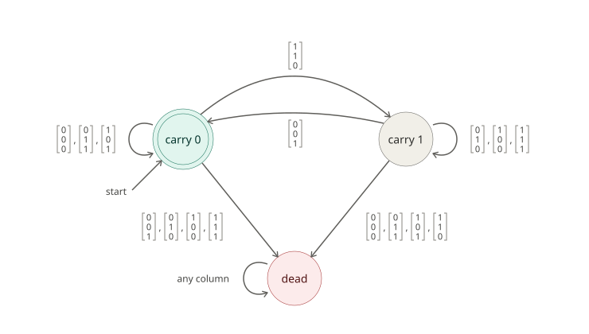

## Intro

I recently worked through a problem from a theory of computation textbook that asked me to prove a property of a language using finite automata.
The informal proof is a simple constructive proof where you build an automaton and show that it recognizes the language.
This is kind of similar to program verification, so I thought it'd be interesting to see what it takes to formalize the proof.
Lean is a good choice for this, because its [Mathlib](https://lean-lang.org/use-cases/mathlib/) has all the theorems needed for the problem.

After finishing the formal proof, I decided to write it up, because I think it provides good insight into what it takes to formally prove properties of a system.
The construction that we're going prove is itself a program, so we don't just end up with a mathematical proof, but also a verified implementation.

I tried to make the subject accessible.
If you're comfortable with a modern statically typed programming language (such as TypeScript or Rust), binary arithmetic, and inductive proofs, you should have no difficulties following along.

## Background: DFAs & Regular Languages

*Feel free to skip this section if you're comfortable with DFAs and regular languages.*

Finite automata provide a model of computation with fixed memory.
Finite automata are not only important for theory, they also have important practical applications. 
For example, finite automata are relevant for regular expressions, where a [bug](https://blog.cloudflare.com/details-of-the-cloudflare-outage-on-july-2-2019/) once took a significant portion of the internet down.

### Deterministic Finite Automaton (DFA)

A **deterministic finite automaton** (DFA) is a machine with a fixed, finite set of states that reads its input one symbol at a time, left to right, updating its state with each symbol using a deterministic transition function.
After the last symbol, the machine either sits in an *accepting* state (input is accepted) or not (input is rejected).

If you've ever written a simple regular expression like `-?[0-9]+`, then you've constructed a DFA. 
This regex matches integer literals like `12` and `-123` and the corresponding DFA looks like this (the arrows are annotated with the symbols that lead to the next state):



This DFA has four states:
- **Start:** this is where we start before processing the first character. Since the start state is not an accepting state, we reject the empty string.
- **Sign:** we move to the sign state when we encounter the `-` character in the start state. We can skip the sign state and jump directly to digits from start, since the sign character is optional (`-?`). If we're in this state at the end of the string, then we reject the string.
- **Digits:** we move from start or sign to digits when we encounter a digit character (`[0-9]`). If we're in the digits state and encounter a digit character again, then we stay in the digit state. The digit state is the only accepting state of the DFA. If we're in this state after we've processed the input string, then the DFA accepts the string.
- **Dead:** we get into this state if we encounter any other character than a digit (unless it's a negative sign at the start). If we're in the dead state at the end of the string, then the DFA rejects the string. Once we're in the dead state, we stay in it, so the dead state in this DFA is a *sink*.

The set of input symbols to the machine is defined by the set $\Sigma$. 
In our regex example, $\Sigma = \left\{-, 0, 1, 2, \ldots, 9\right\}$.

### Regular Languages

A **language** is just a set of strings, and a language is called **regular** if some DFA accepts the strings in it. 
Recognizing regular languages is the class of decision problems solvable with a constant amount of memory in the input size.

Regular languages have useful closure properties: the union, intersection, complement, and (important for us) **reversal** of a regular language is regular.

The standard way to prove that a language is regular is to build a DFA and show that it accepts exactly that language.

We can describe a language $A$ with set-builder notation: 
$$A = \bigl\{\, w \in \Sigma^{*} \bigm| P(w) \,\bigr\}$$


$\Sigma^{*}$ means the set of strings that are created by all possible concatanations of symbols in $\Sigma$ and $P(w)$ is the logical proposition that the string $w$ is well-formed.

Let's apply this notation to our regex example: `-?[0-9]+`. Then $\Sigma^{*}$ contains string like `""`, `"123"`, `"-111"`, `"2-625-"`, etc. and $P(w)$ can be defined as "$w$ is not empty and only its first character can be a negative sign". 


## The Problem

The problem that we're going to solve is from the [Introduction to the Theory of Computation,](https://math.mit.edu/~sipser/book.html) 3rd ed. by Michael Sipser:

> **1.32** Let
>
> $$\Sigma_3 = \left\{ \begin{bmatrix}0\\0\\0\end{bmatrix}, \begin{bmatrix}0\\0\\1\end{bmatrix}, \begin{bmatrix}0\\1\\0\end{bmatrix}, \ldots, \begin{bmatrix}1\\1\\1\end{bmatrix} \right\}.$$
>
> $\Sigma_3$ is the set of all height-3 columns of 0s and 1s, so a string over
> $\Sigma_3$ determines three rows of bits. Reading each row as a binary number,
> define
>
> $$B = \bigl\{\, w \in \Sigma_3^{*} \bigm| P(w)  \,\bigr\}$$
>
> where $P(w)$ is the proposition that the the bottom row of $w$ equals the sum of the top two rows.
>
> Show that $B$ is regular. (Hint: it is easier to work with $B^{\mathcal{R}}$.)

The problem defines an unusual alphabet.
Instead of regular characters like `[a-z]`, the alphabet is made up of columns of three bits.
So instead of a language that consists of strings like `"apple"`, `"banana"`, etc, the language consists of two dimensional bit strings like

```
011
001
100
```

where the first column is the first "character" and so on.

The rule to decide whether a string is in the language is to add the first two rows of the string and check whether they match the third.

For example, the following string is in the language:

```
011 # x row: first term is 3 in decimal
001 # y row: second term is 1 in decimal
100 # z row: sum is 4 which is equal to 3 + 1
```

But the following string is not in the language:

```
01 # x row: first term is 1 in decimal
00 # y row: second term is 0
11 # z row: sum is 3 which is not equal to 1 + 0
```

While a language like this may look weird at first, it's actually a lot easier to write a program that recognizes this language as opposed to a program that recognizes a natural language, since we just need to check the equation

$$ x + y = z$$

to determine whether a string is in the language. 
The challenge in this problem is that we need to do this with a fixed amount of memory for arbitrarty long strings.

## The Solution

The trick is to remember how you add numbers by hand: you work from the least significant digit to the most significant, and the only thing you carry from one column to the next is the carry.

But a DFA reads left to right, and the problem presents the numbers most significant bit first.
So we don't recognize $B$ directly. 
Instead we build a DFA to recognize its reversal $B^R$ which is the same strings that are in $B$ written backwards, so the machine sees the least significant column first.

If we can build a DFA to recognize $B^R$, then we can conclude that $B^R$ is a regular language.
Since $B^R$ reversed is $B$, we can use of the closure property of the reversal of natural languages to conlcude that $B$ is regular as well which concludes the solution.

### Adder Arithmetic

When doing the arithmetic column-by-column, we compute the sum bit at each step as follows: 

$$x_i \oplus y_i \oplus c_{in} = z_i$$ 

where $x, y$ are the addend bits, $z$ is the sum bit, $i$ denotes the ordinal of the current column, and $c_{in}$ is the input carry from the previous step.
We compute the output carry denoted $c_{out}$ for the next step as follows:

$$c_{out} = (x_i \wedge y_i) \vee \left( c_{in} \wedge (x_i \oplus y_i) \right)$$
This means that that there is a carry either if both terms are $\mathtt{1}$ or there was an input carry and least one of the terms is $\mathtt{1}$. Note that a simpler way to compute $c_{out}$ is to check if at least two of $x_i$, $y_i$ and $c_{in}$ are $\mathtt{1}$ (we'll make use of this in the Lean proof).

### Adder DFA

With this in mind, here is the DFA that recognizes $B^R$:



The adder DFA has three states:

- **Carry 0:** We're in this state if the carry is 0 before processing the next column. This is both the starting and the accepting state, since a leftover carry at the end would mean the sum overflowed the bottom row. 
- **Carry 1:** We're in this state if the carry is 1 before processing the next column. This state is non-accepting, since a word ending here has a carry left over, so the sum overflowed. But unlike the dead state we can still leave it, since a $\left[\begin{smallmatrix}\mathtt{0}\\\mathtt{0}\\\mathtt{1}\end{smallmatrix}\right]$ column absorbs the pending carry and takes us back to carry 0. 
- **Dead:** We end up in this state if the sum doesn't match. This is a sink state meaning it's terminal.


The arrows are annotated with the columns that lead from the input state to the output state.
If the figure looks confusing at first, the following examples will hopefully make it clearer.

### Example 1

Let's trace the first example from the problem through the DFA:

```
011 # x row: 3 in decimal
001 # y row: 1 in decimal
100 # z row: 4 in decimal
```

Unrolling the run turns it into a straight line with one copy of the state per step.
The DFA recognizes $B^R$, so it reads the columns backwards.



The run ends in carry 0 (the accepting state), so the reversed word is in $B^R$. 
Due to the closure property of reversal, the original word is in $B$ as well.

Note that the machine passes *through* the non-accepting carry 1 state twice.
Had the word stopped after either of the first two column, it would have been rejected, since $\mathtt{1} + \mathtt{1} = \mathtt{0}$ and $\mathtt{11} + \mathtt{01} = \mathtt{00}$ are both wrong without somewhere to put the carry.

### Example 2

Now the second example, which should be rejected:

```
01 # x row: 1 in decimal
00 # y row: 0 in decimal
11 # z row: 3 in decimal
```



The first column is fine on its own ($\mathtt{1} + \mathtt{0}$ really is $\mathtt{1}$) so the machine can't tell anything is wrong yet.
But the second column fails: with no carry pending, $\mathtt{0} + \mathtt{0}$ must produce $\mathtt{0}$, but the bottom row claims $\mathtt{1}$.
The run ends outside the accepting state, so the second example is rejected.

Note that since the dead state is a sink state, the string would get rejected even if there were more valid columns after the second column.


## The Lean Proof

Our goal is to show that the language $B$ from the [problem](#the-problem) is [regular.](#regular-languages)
As discussed earlier, in order to show that a language is regular, we need to build a [DFA](#deterministic-finite-automaton-dfa) and show that it accepts the language.

The Lean proof will consist of three parts:

1. A **specification** of the language $B$.
2. An executable **implementation** of the [adder DFA](#the-adder-DFA).
3. A **proof** connecting the specification and the implementation.

In addition to being a proof assistant, Lean is also a functional programming language, so the specification and the implementation will look like a regular program in a statically typed functional language.
Lean's [Mathlib](https://lean-lang.org/use-cases/mathlib/) has first class support for formal languages and DFAs, so we will just need to instantiate structures from the library to specify the language $B$ and implement the adder DFA.

For the proof, we'll have to do more work, but Mathlib will be helpful here as well, as it contains the theorem that regular languages are closed under reversal, which will save a lot of work.
The proof will contain some unfamiliar syntax, but under the hood it's just a program.
In fact, the proof is accepted if the program compiles.

Below is a figure laying out the components of the program. The full code can be found on [Github.](https://github.com/agostbiro/my-lean/tree/main/theory-of-computation/TheoryOfComputation/Chapter1_Problem32)




### The Specification

The alphabet from the problem is made up of columns of three bits. 
We can represent one column with a tuple of three booleans in Lean:

```lean
abbrev Sigma3 := Bool × Bool × Bool
```

Then we use [`Mathlib.Computability.Language`](https://leanprover-community.github.io/mathlib4_docs/Mathlib/Computability/Language.html#Language) to define $B$:

```lean
def B : Language Sigma3 :=
  { wBE | valueBE (row3 wBE) = valueBE (row1 wBE) + valueBE (row2 wBE) }
```

`Language` is a generic implementation of formal languages that comes with standard operations and associated theorems.
We instantiate it using our alphabet `Sigma3` and the predicate for membership in $B$ (recall that a language is a set of strings).

`wBE` is a big-endian word in the language, which is a list of `Sigma3` values, i.e. a 2D list of binary values with three rows.
`rowN` is a function that selects the nth row of the 2D list from the top.
`valueBE`  is a function that turns a binary list into a natural number using a big-endian interpretation.[^1]
So the predicate is just $z = x + y$ from our earlier examples.

If you've used programming languages with set comprehensions, the set builder syntax might look familiar, but we're not constructing a collection here.
`Language` is just a `Set` under the hood and `Set` in Lean is a function that tests whether an element is in the set.[^2]
So our definition of $B$ gets unrolled to a function definition under the hood:

```lean
  def B : List Sigma3 → Prop :=
    fun wBE => 
        valueBE (row3 wBE) = valueBE (row1 wBE) + valueBE (row2 wBE)
```

The function has one argument of type `List Sigma3` which is a generic list that holds `Sigma3` objects. 
This is pretty standard so far, but the return type is more interesting.
In a typical programming language, you'd expect a membership test to return a boolean.
But the return value here is `Prop` which is the type of all propositions in Lean (a proposition is something that may or may not have a proof).

So how does a membership test work then?
The expression `wBE ∈ B` applies the function to `wBE`, which gives back a proposition.
In Lean a proposition is itself a type, and its values are proofs of the proposition.
So instead of evaluating `wBE ∈ B` to a boolean, we prove it: to show that a word is in the language, we construct a value of the proposition's type. 
And to show that a word isn't in the language, we construct a value of the negated proposition.
A membership test is a type check, not a computation at runtime.

### The Implementation

We first define the states of the DFA (carry 0, carry 1, dead) as a sum type:

```lean
inductive DfaState where
  | carry (c : Bool)
  | dead
  deriving DecidableEq, Fintype
```

We could define the same state using an enum in Rust or a discriminated union in TypeScript.
Lean's `inductive` type does a bit more though than a recursive sum type in these languages: it also generates some scaffolding that makes it easy to use the type in proofs. 
We'll see more of this later.

Now onto the derives. 
`DecidableEq` just says this type supports full equality checks (same as deriving `Eq` in Rust), but `Fintype` is something that's only available in proof assistants.
It says that the type has finitely many values and it creates a list of them plus a proof that the list is complete.
Deriving `Fintype` lets us claim later on that the language can be recognized with constant memory, therefore it's regular.

Next, we define the transition function of the DFA:

```lean
def dfaStep : DfaState → Sigma3 → DfaState
  | .dead, _ => .dead
  | .carry c, (x, y, z) =>
      if z = (x ^^ y ^^ c) then  -- ^^ is XOR
        .carry (Bool.atLeastTwo x y c)
      else
        .dead
```

The function has two arguments, the current state and the next symbol, and returns the next state.

As we saw earlier, the dead state is a sink, so it always maps to itself.
If we're in the carry state, and the adder equation checks out, then the next state is the value of carry out.
Otherwise we enter the dead state.

`dfaStep` is just a regular function that we can execute, so let's run a quick sanity check.



```lean
#eval dfaStep (.carry false) (true, true, false)  
-- Prints: DfaState.carry true
```

If we want to make sure this holds, we can turn it into an example:

```lean
example :
    dfaStep (.carry false) (true, true, false) = .carry true := by
  decide
```

The `example : ... := by decide` structure in Lean is kind of like a unit test, except it's a proof that's checked at compile time by executing the code.
This works, because Lean rejects functions that are not total (where it cannot be prove that they terminate), unless the definition opts out explicitly, and because we derived `DecidableEq` for `DfaState`, so the equality can be checked.

Finally, we use the generic [`Mathlib.Computability.DFA`](https://leanprover-community.github.io/mathlib4_docs/Mathlib/Computability/DFA.html#DFA) structure from Mathlib to complete the implementation.
We give it the transition function and define the start and accept states:

```lean
def adderDFA : DFA Sigma3 DfaState where
  step := dfaStep
  start := .carry false
  accept := {.carry false}
```

`DFA` integrates with `Mathlib.Computability.Language` which will make it easy to prove later on that our language is regular.

`DFA` also comes with [`evalFrom`](https://leanprover-community.github.io/mathlib4_docs/Mathlib/Computability/DFA.html#DFA.evalFrom), which runs the machine step-by-step from a given starting state over a list of symbols.
We can use it to evaluate [Example 2](#example-2) as a compile-time check:


```lean
example :
    adderDFA.evalFrom (.carry false)
      [(true, false, true), (false, false, true)] = .dead := by
  decide
```

The run starts from `.carry false`  and ends in `.dead` as expected.


### The Proof

As discussed earlier, in order to prove that the language $B$ is regular, we need to first show that the adder DFA accepts the reverse of the language. 
We can then use the closure property of the reversal of regular languages to prove that $B$ is regular.
For the second step we can just use the [Language.isRegular_reverse_iff](https://leanprover-community.github.io/mathlib4_docs/Mathlib/Computability/NFA.html#Language.isRegular_reverse_iff) theorem from Mathlib, but for the first step we'll have to do some work. 

Mathlib [defines](https://github.com/leanprover-community/mathlib4/blob/bbcd1968ee6950abe88b85dba6995da346c4b2a8/Mathlib/Computability/DFA.lean#L353-L355) the predicate `IsRegular` for a language as follows:

```lean
/-- 
A regular language is a language that is defined by a DFA with 
  finite states. 
-/
def IsRegular {T : Type u} (L : Language T) : Prop :=
  ∃ σ : Type, ∃ _ : Fintype σ, ∃ M : DFA T σ, M.accepts = L
```

The `{T : Type u} (L : Language T)` argument makes this a super general definition. The important part here is that the language can have any type of symbols.
The return type is again `Prop`.

`∃ σ : Type, ∃ _ : Fintype σ` is just a tedious way of saying that the state of the DFA must have a constant number of values.
The interesting part is `∃ M : DFA T σ, M.accepts = L` which says that a language is regular if the language accepted by some DFA equals the language. 
So when does a DFA accept a language?

The language the DFA accepts can be defined as follows:[^3]

```lean
def accepts : Language α := 
  {word | M.evalFrom M.start x ∈ M.accept}
```

This means that the language that the DFA accepts is the set of words for which evaluating the DFA from the starting state leads to an accepting state.

Our job is now to prove that the set that is `B.reverse` is equal to the set that is `adderDFA.accepts`.
This is formalized in our proof as follows:

```lean
theorem adderDFA_accepts_B_reverse : adderDFA.accepts = B.reverse := by
  ...
```

The way we're going to do this is by showing that the adder DFA computes the same equation that is the membership check for `B.reverse` which is defined as follows:

```lean
B.reverse = { w | w.reverse ∈ B }
```

`B` reads its rows most significant bit first with `valueBE`. 
Reading the reversed string big-endian is the same as reading the original string least signifcant bit first.
In other words, while we interpret bit strings big-endian for `B`, we interpret them as little-endian for `B.reverse`. 
The membership test for `B.reverse` is therefore equivalent to:[^4]

```lean
{ wLE | valueLE (row1 wLE) + valueLE (row2 wLE) = valueLE (row3 wLE)}
```

The way we're going to prove the `adderDFA_accepts_B_reverse` theorem is by showing that running the adder DFA on `wLE` is equivalent to the membership test for `B.reverse`.
The challenge is that the definition language is descriptive while the adder DFA is an algorithm which is prescriptive.

Working towards the proof, recall that at each step, the DFA checks 

$$ x_i \oplus y_i \oplus c_i = z_i$$

where $x, y, z$ are the rows of the input respectively from the top, $i$ denotes the ordinal of the current column, and $c_{in}$ is the input carry. 

If the equation for $z_i$ holds, the DFA moves to the state determined by the output carry denoted by $c_{out}$ which is defined as follows:

$$c_{out} = (x_i \wedge y_i) \vee \left( c_{in} \wedge (x_i \oplus y_i) \right)$$

This means that that there is a carry either if both terms are $\mathtt{1}$ or there was an input carry and least one of the terms is $\mathtt{1}$. Note that a simpler way to compute $c_{out}$ is to check if at least two of $x_i$, $y_i$ and $c_{in}$ are $\mathtt{1}$ (we'll make use of this in the Lean proof).

Next, recall that we need to check the equation

$$ x + y = z $$

to determine whether whether an input string is in the language $B$. Let's expand this to include information about the length of the string (denoted as $n$), and the steps ($i$ as before, zero indexed): 

$$\sum_{i=0}^{n-1} x_i 2^i + \sum_{i=0}^{n-1} y_i 2^i = \sum_{i=0}^{n-1} z_i 2^i$$

This lets us verify that the first $n$ bits of the sum of the two top rows matches the bottom row.
But we also need to check that the the sum didn't overflow, so we need to add the final carry to the equation ($c_{out}$ is the carry after $n-1$ steps):

$$\sum_{i=0}^{n-1} x_i 2^i + \sum_{i=0}^{n-1} y_i 2^i = \sum_{i=0}^{n-1} z_i 2^i + c_{out} \cdot 2^n$$

As we've seen, the value of $c_{out}$ not only depends on $x_i$ and $y_i$, but also on $c_{in}$, so we need to add this term to create a link between the DFA and the mathematical formulation ($c_{in}$ is the carry before the first step):


$$\sum_{i=0}^{n-1} x_i 2^i + \sum_{i=0}^{n-1} y_i 2^i + c_{in} = \sum_{i=0}^{n-1} z_i 2^i + c_{out} \cdot 2^n$$

This may seem superfluous, since $c_{in}$ will be always zero at the start of the DFA, but formulated this way, we can talk about intermediate steps where $c_{in}$ may be non-zero.

Everything hinges on one **run invariant**, proved by induction on the word:
> **Invariant.** Running the machine over a (little-endian) word $w$ starting with carry $c_{\mathrm{in}}$ ends in state $c_{\mathrm{out}}$ if and only if
>
> $$\mathrm{row}_1(w) + \mathrm{row}_2(w) + c_{\mathrm{in}} = \mathrm{row}_3(w) + c_{\mathrm{out}} \cdot 2^{|w|}$$
>
> where the rows are read as little-endian binary numbers.

This is just the grade-school addition invariant: after processing the low $|w|$ columns, the columns seen so far add up correctly, and the pending carry is worth $2^{|w|}$ — it's waiting to be added at the next position.

- **Base case** (empty word): the machine doesn't move, and the equation degenerates to $c_{\mathrm{in}} = c_{\mathrm{out}}$ (both sides are just the carries, since all rows are 0 and $2^0 = 1$).
- **Inductive step**: peel off the first (lowest) column. The single-column transition is correct precisely when $x + y + c_{\mathrm{in}} = z + 2 c_{\mathrm{mid}}$ — the defining equation of a full adder — and the rest of the run is handled by the induction hypothesis with $c_{\mathrm{mid}}$ as the new carry-in. Algebraically, this corresponds to splitting an addition equation into its low bit plus the remaining high bits.

Instantiate the invariant with $c_{\mathrm{in}} = c_{\mathrm{out}} = \mathtt{false}$ (no carry into the lowest column; no carry out of the highest, or the sum overflowed) and the carry terms vanish:

$$\mathrm{row}_1(w) + \mathrm{row}_2(w) = \mathrm{row}_3(w)$$

— which is exactly membership in $B^R$.

Finally: the machine has finitely many states, so $B^R$ is regular, so $B$ is regular by closure under reversal. $\blacksquare$
We can bridge the gap by introducing 

$$ x + y = z$$

[^1]: Instead of using the `LE/BE` convention to distinguish between interpretations of lists of bits, we could introduce separate types for little- and big-endian lists of bits to prevent mixing them up. However this would require re-deriving many of the theorems that are already available for native lists, so it's not worth it for a project of this scope.

[^2]: Set as a collection is available as `Std.HashSet` and `Std.TreeSet`.

[^3]: The actual Mathlib [definition](https://github.com/leanprover-community/mathlib4/blob/bbcd1968ee6950abe88b85dba6995da346c4b2a8/Mathlib/Computability/DFA.lean#L123-L124) is a bit more verbose, so I'm not quoting it here.

[^4]: The informal argument about the equivalence of the little-endian interpretation of a word and the big-endian interpretation of its reversal (`valueLE w = valueBE w.reverse`) is formalized in the proof, but it's basically just bookkeeping, so I didn't include it in the post.
